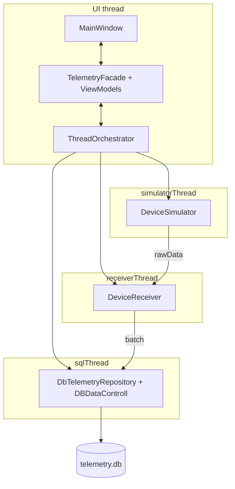

# SystemMonitoring

Qt/C++ приложение для мониторинга телеметрии датчиков: генерация потока данных, запись в SQLite, отображение в таблице с сортировкой, фильтрацией и «скользящим» окном просмотра.

## Архитектура

**Паттерн: MVVM** (Model–View–ViewModel) поверх **слоистой** организации кода. View не ходит в БД и не знает о потоках; ViewModel держит состояние экрана и команды; Model - доменные типы, источники данных и персистентность.

| Роль MVVM | В проекте | Папка |
|-----------|-----------|-------|
| **View** | `MainWindow`, `.ui`, привязка виджетов к ViewModel | `View/` |
| **ViewModel** | `TelemetryViewModel`, `FilterViewModel`, `StatisticsViewModel`; `TelemetryTableModel` - адаптер для `QTableView` | `ViewModels/` |
| **Model** | `SensorData`, фильтры, merge-логика; `ITelemetryRepository`, SQLite, симулятор/приёмник | `Domain/`, `Infrastructure/` |

**Application** (`TelemetryFacade`, `ThreadOrchestrator`) - glue-слой: собирает ViewModel с Model, маршрутизирует запросы и сигналы между UI-потоком и фоновыми потоками. Это не отдельная «буква» MVVM, а координация жизненного цикла и потоков.

Слои по ответственности:

| Слой | Папка | Назначение |
|------|-------|------------|
| **Domain** | `Domain/` | Чистые типы и логика без Qt UI: `SensorData`, `FilterQuerySpec`, `TelemetryMerge`, константы |
| **Application** | `Application/` | Координация: `TelemetryFacade`, `ThreadOrchestrator`, контракт `ITelemetryRepository` |
| **Infrastructure** | `Infrastructure/` | Устройства (`DeviceSimulator`, `DeviceReceiver`) и персистентность (`DBDataControll`, SQLite) |
| **ViewModels** | `ViewModels/` | Состояние и команды UI (MVVM) |
| **View** | `View/` | Отображение и пользовательский ввод (MVVM) |

Точка входа: `View/main.cpp` -> `MainWindow` -> `TelemetryFacade`.



## Потоки и синхронизация

Все объекты, работающие с данными, живут в **отдельных `QThread`**:

| Поток | Объекты | Роль |
|-------|---------|------|
| **UI (главный)** | `MainWindow`, все ViewModel, `ThreadOrchestrator`, `TelemetryFacade` | Отрисовка, реакция на пользователя |
| **simulatorThread** | `DeviceSimulator` | Периодическая генерация пакетов `SensorData` |
| **receiverThread** | `DeviceReceiver` | Буферизация и сброс батчей в репозиторий |
| **sqlThread** | `DBDataControll`, `DbTelemetryRepository` | Единственное подключение к SQLite, INSERT/SELECT |

Межпоточное взаимодействие - **только через сигналы/слоты Qt**:

- **`Qt::QueuedConnection`** - основной режим: вызов ставится в очередь целевого потока. Для передачи батчей между потоками используется `SensorDataBatch` (`QSharedPointer<const QVector<SensorData>>`): в очередь копируется только указатель и счётчик ссылок, а не весь вектор. Для типа нужны `Q_DECLARE_METATYPE` / `qRegisterMetaType`. Внутри потока `DeviceReceiver`  накапливает записи в локальный буфер; `TelemetryViewModel` копирует данные в свой `records` при отображении.
- **Стоимость копий:** на границах потоков тяжёлые батчи не дублируются в `QMetaCallEvent`. Оставшиеся копии - агрегация в приёмнике и владение буфером таблицы в UI; для текущих объёмов это дёшево по сравнению с SQLite и отрисовкой.
- **`Qt::BlockingQueuedConnection`** - только при остановке (`stopAll`): главный поток ждёт завершения `stopGeneration` / `shutdownDatabase`, чтобы корректно выйти из потоков.

### Межпоточная синхронизация и особенности работы потоков

Приложение **однопроцессное**: потоки не делят мутабельную память напрямую. Синхронизация строится на **affinity `QObject`** (у каждого объекта свой поток) и **очереди событий Qt** - слоты вызываются последовательно в потоке получателя.

Как это устроено в коде:

- **`Qt::QueuedConnection`** на границах simulator -> receiver -> sql -> UI: аргументы доставляются через `QMetaCallEvent`; два слота одного объекта не выполняются параллельно.
- **Владение состоянием по потокам:** `m_localBuffer` - только `receiverThread`, SQLite/`DBDataControll` - только `sqlThread`, `records` во ViewModel - только UI; гонок за одним буфером нет.
- **`SensorDataBatch`** - между потоками передаётся `QSharedPointer<const QVector<...>>`; батч после создания только для чтения.
- **Остановка** - в `stopAll()` `Qt::BlockingQueuedConnection` даёт синхронную точку перед `quit()`/`wait()`.

**`QMutex` в проекте не используется** - для текущей схемы он избыточен. Понадобится, если появится общий мутабельный буфер вне event loop, `DirectConnection` между потоками, ручная очередь без signals/slots или межпроцессный обмен (shared memory, pipe).

Цепочка записи:

```
DeviceSimulator::rawDataGenerated
  -> DeviceReceiver::onRawDataReceived   (queued)
  -> DeviceReceiver::dataBatchReady
  -> DbTelemetryRepository::saveBatch
  -> DBDataControll::onSaveBatchToSql    (queued, sql thread)
  -> emit batchCommitted(inserted)
  -> TelemetryViewModel::onBatchCommitted (queued, UI thread)
```

Цепочка чтения (сортировка, фильтр, скролл):

```
TelemetryViewModel::sortRequested / tailRequest / rangeNearAnchorRequested
  -> ThreadOrchestrator
  -> DbTelemetryRepository::fetch* / applyFilterQuery
  -> DBDataControll::*                     (queued, sql thread)
  -> emit dataLoaded / tailDataLoaded / rangeNearAnchorLoaded
  -> TelemetryViewModel::on*Loaded         (queued, UI thread)
```

**Важно:** к `QSqlDatabase` обращается только поток `sqlThread`. Прямых SQL-вызовов из UI нет - всё через `QMetaObject::invokeMethod` в репозитории.

## Режимы таблицы

### Обычный режим (без фильтра)

- В памяти держится **скользящее окно** (~`WINDOW_SIZE` = 500 строк, подгрузка чанками по `CHUNK_SIZE` = 40).
- При генерации данных и «прилипании» к хвосту (`followLiveTail`) ViewModel запрашивает новые строки у БД (`tailRequest`, `rangeNearAnchorRequested`).
- Позиция скролла определяет `followLiveTail`: внизу при сортировке по возрастанию - следим за новыми записями.

### Режим фильтра

- `liveUpdatesEnabled = false` - полная перезагрузка из БД не дёргается на каждый батч.
- После INSERT приходит `batchCommitted(inserted)` с уже присвоенными `recordId`.
- Если скролл **простаивает** 200 ms (`scrollIdle`), подходящие по `FilterQuerySpec::matches()` строки **вставляются в текущее окно** через `TelemetryMerge::mergeFilteredInsertions` (с учётом сортировки и зоны viewport: верх / середина / низ).
- На время merge скролл таблицы кратковременно блокируется (`mergeStarted` / `mergeFinished`).

### Перезагрузка и блокировка UI

- `beginReloading` / `loadingStarted` - очистка буфера, overlay со спиннером, блокировка фильтра, сортировки, connect/disconnect.
- `finishReloading` / `loadingFinished` - восстановление интерактивности.

## Тонкие моменты

### `SensorData` - это **запись телеметрии (DTO)**, а не объект с поведением. Ей не нужны инкапсуляция, виртуальные методы и полиморфизм. `struct` с публичными полями даёт:

- **Компактный POD-layout** (~32 байта, поля подряд) - без vtable и скрытых указателей, как у «тяжёлого» класса.
- **Плотное хранение в `QVector`** - элементы идут непрерывным блоком памяти; при сортировке, merge и обходе таблицы процессор подтягивает соседние записи в L2/L3 одним кэш-лайном.
- **Дешёвое копирование и агрегатная инициализация** - `{id, sensorId, ts, value}` без конструкторов и геттеров; удобно в симуляторе, тестах и SQL-слое.
- **Те же гарантии, что у `class` в C++** - разница только в дефолтной видимости членов; для записи «4 поля данных» `struct` честнее отражает намерение.

Альтернативы здесь хуже по смыслу или по ресурсам: `std::tuple` - тот же размер, но без имён полей; класс с private + accessors - шум в коде без выигрыша, пока нет инвариантов, которые надо охранять внутри типа.

```cpp
struct SensorData {
    static constexpr uint64_t DEFAULT_RECORD_ID = 0;
    // ...
    uint64_t recordId = DEFAULT_RECORD_ID;
    uint64_t sensorId = DEFAULT_SENSOR_ID;
    uint64_t timestamp = DEFAULT_TIMESTAMP;
    double value = DEFAULT_VALUE;
};
```

- **Память и кэш:** см. выше; комментарий в `sensordata.h` как раз про layout, не про `constexpr`.
- **`const &` при передаче:** внутри одного потока избегаем лишних копий 32-байтной структуры; между потоками батчи идут как `SensorDataBatch` (см. `Domain/sensordatabatch.h`).
- **`DEFAULT_RECORD_ID == 0`:** семантический маркер «id ещё нет». Симулятор создаёт записи с `recordId = 0`; после INSERT БД присваивает реальный id и шлёт в `batchCommitted`. Merge и anchor-запросы игнорируют строки с нулевым id.

### `SensorDataBatch` - батч для межпоточной передачи

```cpp
using SensorDataBatch = QSharedPointer<const QVector<SensorData>>;
```

`const` в типе запрещает мутацию общего батча из чужого потока. Создание: `makeSensorDataBatch(std::move(vector))`. Используется в сигналах simulator -> receiver -> sql -> ViewModel.

### Один connection name для SQLite

`DbConnection::SQL_WORKER_CONNECTION_NAME` - именованное соединение, привязанное к потоку `sqlThread`. SQLite не рассчитан на параллельную запись из разных потоков с одним handle.

### Дублирование состояния фильтра

`ThreadOrchestrator` хранит `filterActive` / `filterSpec` для SQL-запросов; `TelemetryViewModel` - `activeFilterSpec` для in-memory merge. Оба обновляются при apply/reset фильтра. При изменении логики нужно синхронизировать оба места.

### `FilterQuerySpec`

- `toSqlCondition()` - для запросов в БД.
- `matches()` - та же семантика для проверки уже вставленных строк в merge (без повторного SELECT).

### Репозиторий как прокси

`DbTelemetryRepository` реализует `ITelemetryRepository` и перенаправляет вызовы в `DBDataControll` через queued invoke. Это позволяет подменить хранилище в тестах и держать контракт на уровне Application.

## Сборка

- **Qt 6.x** (основная разработка) или **Qt 5.15** — см. CI ниже
- Модули: `core`, `gui`, `widgets`, `sql`, `svg`
- C++20 при Qt 6, C++17 при Qt 5 (`cxx_config.pri`)
- Открыть `SystemMonitoring.pro` в Qt Creator или:

```bash
qmake SystemMonitoring.pro
mingw32-make   # или nmake / make
```

База `telemetry.db` создаётся рядом с исполняемым файлом при первом запуске.

## CI

GitHub Actions (`.github/workflows/ci.yml`) на каждый **push** и **pull request**:

- runner: `ubuntu-latest`
- матрица: **Qt 5.15.2** и **Qt 6.5.3**
- сборка и запуск `tests/SystemMonitoringTests` (без GUI, `QCoreApplication`)

Локально Qt 5.15 не нужен — достаточно пуша в репозиторий.

## Тесты

Каталог `tests/`, проект `tests/tests.pro`:

```bash
cd tests
qmake CONFIG+=release && make -j$(nproc)
./release/SystemMonitoringTests    # Linux / macOS
# debug/SystemMonitoringTests.exe  # Windows (MinGW)
```

Покрытие: доменная логика (`FilterQuerySpec`, `TelemetryMerge`), ViewModel, репозиторий/БД, симулятор, оркестратор потоков.

## Структура каталогов (кратко)

```
Application/     Facade, оркестратор потоков, ITelemetryRepository
Domain/          Типы данных, фильтры, merge-логика
Infrastructure/  Генератор, приёмник, SQLite
ViewModels/      TelemetryViewModel, FilterViewModel, StatisticsViewModel, TableModel
View/            MainWindow, UI
tests/           Qt Test
assets/          Иконки (SVG)
```
